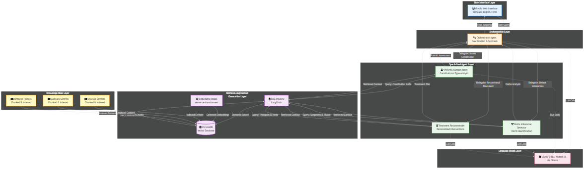
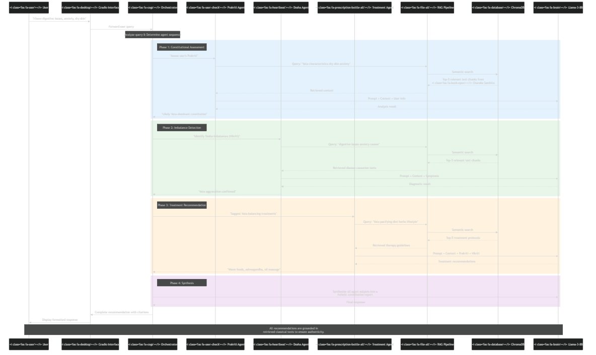

# AyurMind: Multi-Agent Ayurvedic Consultation System


## 🎯 Quick Summary

**Problem:** Ayurvedic experts are rare; AI systems hallucinate wrong medical advice.

**Solution:** Multi-agent system that accurately retrieves from Ayurvedic texts for diagnosis.

**Method:** 4 specialized agents + RAG + Free LLM APIs + ChromaDB = grounded recommendations.

---

## 📁 Project Structure

```
ayurmind/
├── data/
│   ├── raw/                    # Scraped HTML/text files
│   ├── processed/              # Cleaned and chunked documents
│   └── vectordb/               # ChromaDB persistent storage
├── src/
│   ├── scraper/
│   │   ├── __init__.py
│   │   ├── charaka_scraper.py  # Scrape Charaka Samhita
│   │   └── data_processor.py   # Clean and chunk text
│   ├── rag/
│   │   ├── __init__.py
│   │   ├── embeddings.py       # Embedding generation
│   │   ├── vectorstore.py      # ChromaDB interface
│   │   └── retriever.py        # RAG retrieval logic
│   ├── agents/
│   │   ├── __init__.py
│   │   ├── base_agent.py       # Base agent class
│   │   ├── prakriti_agent.py   # Constitution assessor
│   │   ├── dosha_agent.py      # Imbalance detector
│   │   ├── treatment_agent.py  # Treatment recommender
│   │   └── orchestrator.py     # Main coordinator
│   ├── llm/
│   │   ├── __init__.py
│   │   ├── openrouter_client.py # OpenRouter API
│   │   └── local_client.py      # Ollama fallback
│   └── ui/
│       ├── __init__.py
│       └── gradio_app.py        # Chat interface
├── tests/
│   ├── test_rag.py
│   ├── test_agents.py
│   └── test_integration.py
├── notebooks/
│   └── exploration.ipynb        # Jupyter for experiments
├── config/
│   ├── config.yaml              # Configuration
│   └── prompts.yaml             # Agent prompts
├── scripts/
│   ├── 01_scrape_data.py        # Run scraper
│   ├── 02_build_vectordb.py     # Build RAG
│   ├── 03_test_rag.py           # Test retrieval
│   └── 04_run_app.py            # Launch app
├── requirements.txt
├── .env.example
├── .gitignore
├── README.md
└── LICENSE
```

---

## 🚀 Quick Start

### 1. Clone Repository
```bash
git clone https://github.com/yourusername/ayurmind.git
cd ayurmind
```

### 2. Install Dependencies
```bash
pip install -r requirements.txt
```

### 3. Set Up API Keys (Free!)
```bash
cp .env.example .env
# Edit .env and add your OpenRouter API key (free tier)
```

Get free API key: https://openrouter.ai/keys

### 4. Scrape Charaka Samhita Data
```bash
python scripts/01_scrape_data.py
```

### 5. Build Vector Database
```bash
python scripts/02_build_vectordb.py
```

### 6. Test RAG Retrieval
```bash
python scripts/03_test_rag.py
```

### 7. Launch Application
```bash
python scripts/04_run_app.py
```

---

## 🎨 Features

### ✅ Implemented
- [x] Web scraper for Charaka Samhita Online
- [x] Intelligent text chunking with context preservation
- [x] ChromaDB vector database
- [x] Free LLM API integration (OpenRouter)
- [x] Multi-agent architecture (4 agents + orchestrator)
- [x] RAG-powered retrieval (prevents hallucinations)
- [x] Gradio chat interface
- [x] Bilingual support (English + Hindi)

### 🔜 Roadmap
- [ ] Add Sushruta Samhita and Ashtanga Hridaya sources
- [ ] Fine-tuning layer for improved accuracy
- [ ] Conversation memory and context tracking
- [ ] Export consultation reports as PDF
- [ ] Multi-language support (Tamil, Bengali, etc.)
- [ ] Mobile app deployment

---

## 🧠 Architecture

### System Overview

Below is a high-level architectural diagram illustrating the main components and their interactions within the AyurMind system.



### Data Flow

This diagram details the flow of data through the system, from user query to the final synthesized recommendation, highlighting the roles of specialized agents and the RAG pipeline.



*Note: These diagrams are generated from the Mermaid files (`architecture_diagram_with_icons.mmd`, `dataflow_diagram_with_icons.mmd`) located in this repository.*

---

## 📊 Data Sources

Scraping from **Charaka Samhita Online** (https://www.carakasamhitaonline.com):

1. ✅ Sutra Sthana (Fundamental Principles)
2. ✅ Nidana Sthana (Diagnostic Principles)
3. ✅ Vimana Sthana (Specific Medical Principles)
4. ✅ Sharira Sthana (Human Being & Genesis)
5. ✅ Indriya Sthana (Sensorial Prognosis)
6. ✅ Chikitsa Sthana (Therapeutic Principles)
7. ✅ Kalpa Sthana (Pharmaceutical Preparations)
8. ✅ Siddhi Sthana (Therapeutic Procedures)

**Total Expected Chunks:** ~5,000-8,000 text chunks

---

## 🔧 Configuration

### LLM Options

**Option 1: OpenRouter (Free Tier)** - RECOMMENDED
```python
# Supports multiple free models:
- mistralai/mistral-7b-instruct (Free)
- meta-llama/llama-3-8b-instruct (Free)
- google/gemma-7b-it (Free)
```

**Option 2: Local Ollama** - Fallback
```bash
# Install Ollama
curl -fsSL https://ollama.com/install.sh | sh

# Pull model
ollama pull llama3
```

### Vector Database

- **ChromaDB** (persistent storage, no cloud required)
- Embedding Model: `sentence-transformers/all-mpnet-base-v2`
- Chunk Size: 800 tokens with 200 token overlap

---

## 🧪 Testing

### Run Unit Tests
```bash
pytest tests/
```

### Test Specific Components
```bash
# Test RAG retrieval
python -m pytest tests/test_rag.py -v

# Test agent responses
python -m pytest tests/test_agents.py -v

# Test full integration
python -m pytest tests/test_integration.py -v
```

---

## 📖 Usage Examples

### Example 1: Basic Query
```
User: "I have digestive issues and anxiety"

AyurMind:
Based on your symptoms, you appear to have a Vata-dominant constitution 
with current Vata aggravation affecting your digestive and nervous systems.

Recommendations:
• Diet: Warm, grounding foods (cooked vegetables, ghee, rice)
• Herbs: Ashwagandha for anxiety, Triphala for digestion
• Lifestyle: Regular meal times, oil massage, warm baths

[Citations: Charaka Samhita - Vimana Sthana, Chapter 8]
```

### Example 2: Constitutional Assessment
```
User: "What is my Prakriti?"

AyurMind:
To determine your Prakriti, I need to know:
1. Body frame (thin/medium/heavy)?
2. Skin type (dry/oily/combination)?
3. Energy levels (fluctuating/steady/low)?
...
[Interactive assessment follows]
```

---

## 🤝 Contributing

We welcome contributions! Please see [CONTRIBUTING.md](CONTRIBUTING.md) for guidelines.

### Development Setup
```bash
# Create virtual environment
python -m venv venv
source venv/bin/activate  # On Windows: venv\Scripts\activate

# Install dev dependencies
pip install -r requirements-dev.txt

# Install pre-commit hooks
pre-commit install
```

---

## 📄 License

MIT License - see [LICENSE](LICENSE) file for details.

---

## 🙏 Acknowledgments

- **Charaka Samhita Online** for providing accessible classical texts
- **OpenRouter** for free LLM API access
- **LangChain** for RAG framework
- **ChromaDB** for vector storage

---

## 📞 Contact

For questions, feedback, or collaboration:
- Email: your.email@example.com
- GitHub Issues: https://github.com/yourusername/ayurmind/issues
- MBCC 2026 Conference: [Link to paper]

---

## 🌟 Star History

If you find this project useful, please consider giving it a star! ⭐

---

**Built for MBCC 2026 Conference**  
*Bridging 5,000 years of Ayurvedic wisdom with modern AI*
